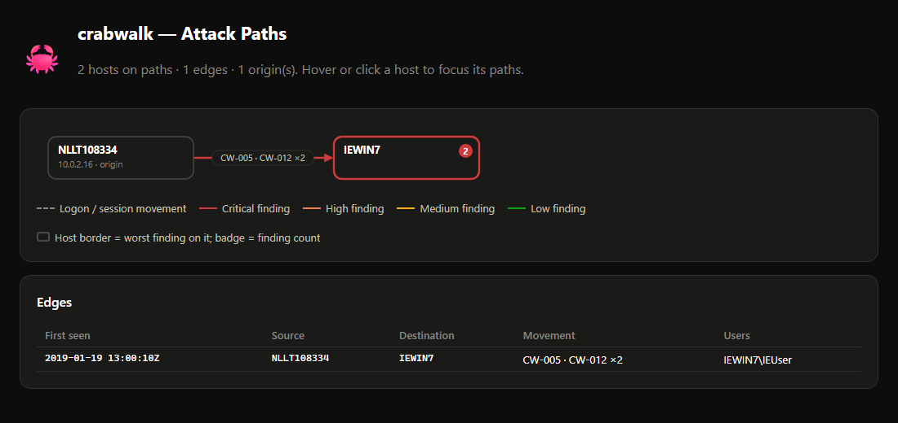

# Renamed PsExec, seen only from the target: recovering the source host from 5145 pipe names

**Provenance, up front.** This is not a real incident. Both logs discussed here are
separate lab recordings from the public
[EVTX-ATTACK-SAMPLES](https://github.com/sbousseaden/EVTX-ATTACK-SAMPLES) corpus
(GPL-3.0, commit `4ceed2f`). Both ship unmodified in this repository's
[`demo/evtx`](../../demo/) folder, so every command below runs on a fresh clone. The
narrative is written the way I would work the case, but every command output below was
produced by running crabwalk 0.1.0 against those files, and nothing outside them is
assumed to exist.

## 1. Situation

An analyst receives one file: the Security log of a workstation, `IEWIN7`, exported
as `LM_renamed_psexecsvc_5145.evtx`. No System log, no Sysmon, no logs from any other
machine. The question is the usual one: did something move laterally onto this box,
and if so, from where?

## 2. Triage

First, what is actually in the file:

```text
> crabwalk parse demo/evtx/LM_renamed_psexecsvc_5145.evtx
files      : 1
records    : 22  (kept: 22, unparsable: 0)
time range : 2019-01-19 12:57:09Z .. 2019-01-19 13:00:10Z
computers  : IEWIN7

Security    5145        22  Network share object access (detailed)
```

Twenty-two records, all event 5145, "A network share object was checked to see
whether client can be granted desired access"
([Microsoft](https://learn.microsoft.com/en-us/previous-versions/windows/it-pro/windows-10/security/threat-protection/auditing/event-5145)),
which is only logged when *Audit Detailed File Share* is enabled. There are no logon
events (4624, 4648 or RDP session events), so crabwalk's session layer has nothing to
build edges from. Everything has to come from
share access. Then the hunt:

```text
> crabwalk hunt demo/evtx/LM_renamed_psexecsvc_5145.evtx --out findings.json --report report.html --graph attack-paths.html
files      : 1
records    : 22  (kept: 22, unparsable: 0)
sessions   : 0 | edges: 0
findings   : 2  (critical 1, high 1)

[CRITICAL] 2019-01-19 13:00:10Z  CW-012  Remote execution over named pipes
    host: IEWIN7   user: IEWIN7\IEUser   ATT&CK: T1021.002, T1569.002, T1570
    PsExec-style stdio pipes: \blabla-NLLT108334-37048-stderr, \blabla-NLLT108334-37048-stdin, \blabla-NLLT108334-37048-stdout, \svcctl; from 10.0.2.16; service 'blabla' (renamed) launched from host NLLT108334 (pid 37048); after 'blabla.exe' was written to \\*\ADMIN$

[HIGH] 2019-01-19 13:00:10Z  CW-005  Executable on administrative share
    host: IEWIN7   user: IEWIN7\IEUser   ATT&CK: T1021.002, T1570
    'blabla.exe' accessed on \\*\ADMIN$ from 10.0.2.16
[...]
wrote findings -> findings.json
wrote report -> report.html
wrote graph -> attack-paths.html
```

The JSON for the CW-012 finding carries `"src_ip": "10.0.2.16"` and
`"src_host": "NLLT108334"`, and cites records 16, 17, 18, 20, 21 and 22 as evidence.
The graph puts both findings on one edge:



## 3. Reading the records

The interesting part is the last eight records, all within 0.4 seconds, all from
`IEWIN7\IEUser` at `10.0.2.16:54765`, logon ID `0x162630`:

| Rec | Share | RelativeTargetName | AccessMask | Meaning |
|---|---|---|---|---|
| 15 | `ADMIN$` | `\` | `0x100088` | open the share root |
| 16, 17 | `ADMIN$` | `blabla.exe` | `0x120196` | write access to a binary in `C:\Windows` |
| 18 | `IPC$` | `svcctl` | `0x12019f` | Service Control Manager RPC pipe, read+write |
| 19 | `IPC$` | `blabla` | `0x12019f` | the service's own control pipe |
| 20 | `IPC$` | `blabla-NLLT108334-37048-stdin` | `0x120196` | client writes to the remote process |
| 21, 22 | `IPC$` | `...-stdout`, `...-stderr` | `0x120089` | client reads its output |

The masks decode with Microsoft's
[file access rights](https://learn.microsoft.com/en-us/windows/win32/fileio/file-access-rights-constants):
`0x120196` is WriteData, AppendData, WriteEA, ReadAttributes, WriteAttributes plus
READ_CONTROL and SYNCHRONIZE (on a pipe, bit `0x4` is CreatePipeInstance rather than
AppendData, per the 5145 page's access table); `0x120089` is exactly
[`FILE_GENERIC_READ`](https://learn.microsoft.com/en-us/windows/win32/fileio/file-security-and-access-rights)
(ReadData, ReadEA, ReadAttributes, READ_CONTROL, SYNCHRONIZE). So the direction of each pipe matches its name: the client
writes stdin and reads stdout/stderr. That is the PsExec sequence: copy a service
binary over `ADMIN$`, create and start it through `svcctl`, then talk to it over
named pipes.

The domain field `IEWIN7` matters too. For local accounts, Microsoft's 5145 page
says the field "will contain the name of the computer". The client authenticated
with IEWIN7's *local* `IEUser` account, not a domain account.

Records 1 to 14 (12:57:09 to 12:57:42) are an earlier session, `0x11d8c8`, from the
same address and account: `winreg`, `srvsvc`, the `ADMIN$` root and `MsFteWds`. Mixed
in are `srvsvc` opens by the machine account `IEWIN7$` from `10.0.2.15`. None of these
is a signature pipe, and crabwalk reports nothing for them. I would read that earlier
session as possible preparation, but this log cannot tell me what tool produced it.

## 4. How CW-012 ties the records together

`src/crabwalk/rules/pipes.py` turns each 5145 on `IPC$` into a pipe hit with the
client address, and marks it remote when that address is not local. Each hit is then
classified:

- **tool**: a known tool pipe (`PSEXESVC`, `RemCom`, `PAExec`, ...) or anything
  matching the stdio pattern `<service>-<host>-<pid>-stdin|stdout|stderr`
  (`STDIO_PIPE`). The three records 20 to 22 land here.
- **control**: a *remote* open of `svcctl`, `ntsvcs` or `atsvc`. Record 18.
- **random**: a remote open of a long hex-named pipe. Not present here.

`blabla` (record 19) matches none of these, so it is not a signature hit, but its
name is remembered for later. Signature hits are clustered per (target host, client
address); a hit more than 120 seconds after the cluster's last one (`cluster_gap`)
starts a new cluster. Here that yields one cluster, from 10.0.2.16, holding records 18
and 20 to 22.

Next, `_credit()` attaches surrounding evidence. Records 16 and 17 are `ADMIN$`
accesses to a name ending in `.exe`, from the same client, 30 ms before the cluster
starts, which is inside the 300-second `drop_window`. They become the cluster's
"drops". A tool pipe plus a drop makes the finding **critical**, and the drop adds
T1570.

Finally, `stdio_origin()` parses the stdio name. It first looks for another pipe name
observed on the same host that prefixes the stdio name (the longest one wins);
`blabla` does. That gives service `blabla`, source `NLLT108334`, pid `37048`. Reading
the number as the client's process ID is an inference: the 2019 MENASEC post cited in
section 5 calls it `<5-random-numbers>`. The corpus supports the pid reading: in the
section 9 sample the number in the pipe names (8116) equals the `ProcessId` of the
`PsExec.exe` client that connects to them (Sysmon 18, records 6 to 8). Since the
service is not `psexesvc`, the summary adds "(renamed)". The finding gets both `src_ip` (from the 5145 records)
and `src_host` (from the pipe name). That pairing is what lets the graph merge
`10.0.2.16` and `NLLT108334` into one node, so CW-005, which only knows the address,
lands on the same edge.

## 5. Why renaming the service does not hide PsExec

`psexec -r` "specifies the name of the remote service to create or interact with"
([Sysinternals](https://learn.microsoft.com/en-us/sysinternals/downloads/psexec)).
The names in this sample (`blabla.exe`, pipe `blabla`, `blabla-NLLT108334-37048-*`)
are consistent with `psexec -r blabla`. The rename does not change the *shape* of
the stdio pipe names, and those still embed the client's computer name. A detection
keyed on the string `PSEXESVC` misses this run. A detection keyed on the structure
does not.

This detection idea is not mine. In February 2019 the MENASEC blog published the pipe
format
`<psexecsvc|chosen service name with the "-r" option>-<machine-name>-<5-random-numbers>-<stdin|stderr|stdout>`
and a 5145 query for renamed services
([archived post](https://web.archive.org/web/20230329171218/https://blog.menasec.net/2019/02/threat-hunting-3-detecting-psexec.html)).
The public Sigma rule
[Suspicious PsExec Execution](https://github.com/SigmaHQ/sigma/blob/master/rules/windows/builtin/security/win_security_susp_psexec.yml),
written by Samir Bousseaden (who also maintains this corpus) and citing that post,
encodes it: 5145 on `IPC$`, name ending in `-stdin`, `-stdout`
or `-stderr`, and *not* starting with `PSEXESVC`. What crabwalk adds is the
attribution step: it parses the host out of the name, pairs it with the 5145 client
address, correlates the `ADMIN$` drop and the `svcctl` open into the same finding,
and merges the address and the name into one node in the graph.

Renaming arguably makes the run more suspicious: an administrator using stock PsExec
has little reason to pass `-r`.

## 6. One attributed execution versus scattered hits

Sigma rules like the one above are evaluated against one event at a time, so that
rule would match records 20, 21 and 22 separately: three alerts that each say
"suspicious PsExec". None of them states the source host. The analyst still has to
read the pipe name, and then manually connect the `ADMIN$` write and the `svcctl`
open. Sigma does define correlation rules (`event_count`, `value_count`, `temporal`
and others in the
[2.1.0 specification](https://github.com/SigmaHQ/sigma-specification/blob/main/specification/sigma-correlation-rules-specification.md)),
which could group these records by time. Those correlations count or co-locate
events. They do not parse a host name out of a field. I did not run Chainsaw or
Hayabusa for this write-up, so I make no claim about their exact output.

crabwalk's CW-012 produces one finding with the records attached, the source address
*and* name, and a severity that reflects the corroboration. To be precise about
crabwalk itself: it also emits CW-005 for the same `.exe` on `ADMIN$`, because CW-005
is a standalone rule and no cross-rule deduplication exists today. The graph shows
the two as one edge, but the console lists two findings.

## 7. ATT&CK mapping

| Technique | Source | Basis |
|---|---|---|
| [T1021.002](https://attack.mitre.org/techniques/T1021/002/) SMB/Windows Admin Shares | crabwalk | `ADMIN$`/`IPC$` use from 10.0.2.16 |
| [T1569.002](https://attack.mitre.org/techniques/T1569/002/) Service Execution | crabwalk | `svcctl` + PsExec stdio pipes |
| [T1570](https://attack.mitre.org/techniques/T1570/) Lateral Tool Transfer | crabwalk | `blabla.exe` written to `ADMIN$` |
| [T1078.003](https://attack.mitre.org/techniques/T1078/003/) Local Accounts | analyst | `IEWIN7\IEUser` is a local account used over the network |

There is no T1543.003 (service creation) because this log contains no 7045 or 4697.
crabwalk does not map T1078.003; I add it by hand.

## 8. What the analyst does next

**Scope NLLT108334 / 10.0.2.16.** Get that machine's Security log (4648 explicit
credentials and 4688 process creation, if enabled), Sysmon if present, and the
PsExec client's process. The pipe name claims pid 37048 there; that is a lead, not
proof. Confirm in DHCP/DNS that 10.0.2.16 really was NLLT108334 at 13:00Z. Then ask
how an attacker got onto it.

**Collect the rest of IEWIN7.** The System log for the 7045 install of `blabla`, the
`blabla.exe` binary itself (hash it), and whatever the service ran. Also look at the
12:57 session.

**Credentials.** The account used was IEWIN7's local `IEUser`. Reset it. Then check
whether the same local password exists on other machines; a shared local admin
password turns one host into many. LAPS or its equivalent is the structural fix.

**Hunt the pattern fleet-wide.** Run crabwalk over every collected Security and
Sysmon log, and search for 5145 `IPC$` names matching `*-*-<digits>-stdin`, any 5145
or 4624 from 10.0.2.16, and the string `NLLT108334` inside pipe names on other hosts.

**Tuning note.** If an IT team legitimately runs PsExec, the allowlist should pin the
*expected* names, not just the source. The stdio pattern also names the admin host,
so the pipe name doubles as a source-host check. With this hypothetical entry:

```toml
[[allow]]
reason = "Hypothetical: IT runs stock PsExec from admin host 10.0.2.16 (change ticket required)"
rules = ["CW-012", "CW-005"]
sources = ["10.0.2.16"]
expires = 2027-03-31
[allow.fields]
RelativeTargetName = '^(svcctl|psexesvc|psexesvc\.exe|psexesvc-NLLT108334-\d+-(stdin|stdout|stderr))$'
```

the renamed run is still reported (`findings   : 2  (critical 1, high 1)`), because
every evidence event must match the field regex (case-insensitively), and neither
`blabla.exe` nor the `blabla-NLLT108334-37048-*` pipe names do. The bare
`psexesvc` alternative is required: a stock run opens the `PSEXESVC` control pipe,
which is a known tool pipe for CW-012 and so lands in its evidence. Without that
alternative the entry suppresses only CW-005. I checked this with a synthetic stock
run, not a recording: the same 22 records with `blabla` replaced by `PSEXESVC` in
memory. With the entry above both findings were suppressed; with the bare `psexesvc`
alternative removed, CW-012 was kept. For the real file, swapping `psexesvc` for
`blabla` throughout the entry gives `findings   : 0` and `suppressed : 2 by allowlist`,
so the regex structure itself is not what keeps the renamed run visible; the names
are. An attacker reusing the admin host with a renamed service therefore stays
visible. One more requirement applies once the System log is collected too: the 7045
install of `PSEXESVC` is then credited to the same finding, and every evidence event
must match one of the entry's field tables. Until a table describes the install,
`hunt` keeps the finding and warns that "no fields table describes their System 7045
evidence".
The fields then become one `[[allow.fields]]` table per kind of record:

```toml
[[allow.fields]]                    # the 5145 opens and the ADMIN$ copy
RelativeTargetName = '^(svcctl|psexesvc|psexesvc\.exe|psexesvc-NLLT108334-\d+-(stdin|stdout|stderr))$'
[[allow.fields]]                    # the 7045 install: name and binary
ServiceName = '^psexesvc$'
ImagePath = '^%SystemRoot%\\PSEXESVC\.exe$'
```

## 9. Contrast: the same trick, run locally

`DE_renamed_psexec_service_sysmon_17_18.evtx` (from the corpus's Defense Evasion
folder) is a different recording, on a different host, of a renamed PsExec service,
this time seen through Sysmon 17/18:

```text
> crabwalk hunt demo/evtx/DE_renamed_psexec_service_sysmon_17_18.evtx
files      : 1
records    : 11  (kept: 11, unparsable: 0)
sessions   : 0 | edges: 0
findings   : 1  (medium 1)

[MEDIUM] 2020-09-27 13:42:01Z  CW-012  Local execution through a remote-exec tool's pipes
    host: MSEDGEWIN10   user: -   ATT&CK: T1569.002
    local use, client ran on this host by psexec.exe: PsExec-style stdio pipes: \svchost-MSEDGEWIN10-8116-stderr, \svchost-MSEDGEWIN10-8116-stdin, \svchost-MSEDGEWIN10-8116-stdout; service 'svchost' (renamed) launched from host MSEDGEWIN10 (pid 8116)
[...]
```

The stdio pipes are connected (Sysmon 18) by `C:\Windows\system32\PsExec.exe`, a
process on the host itself, and the host name in the pipe is the host's own name.
CW-012 therefore calls it local, drops T1021.002, sets severity to medium and does
not set a source. That is still worth a look (the service binary is
`C:\Windows\svchost.exe`, outside System32, consistent with
[T1036.005](https://attack.mitre.org/techniques/T1036/005/), which crabwalk does not
detect), but it is not lateral movement, and labeling it so would send the analyst
looking for a source host that does not exist.

## 10. Limitations

What this single log cannot prove:

- **That anything ran.** 5145 records an access *check* for *requested* rights. A
  write mask on `blabla.exe` is not proof that bytes were written, and no record shows
  the service starting or the process it spawned. crabwalk also treats any access to
  an executable name on `ADMIN$` as a drop, without checking the mask.
- **The source name is client-supplied.** `NLLT108334` comes from the client's pipe
  name. A modified tool could write any name there. The address 10.0.2.16 is better
  evidence, and NAT or a proxy would hide even that.
- **What was executed.** The command line and output never appear in 5145.
- **How IEUser's password was obtained**, or whether the 12:57 session was the same
  operator.
- **Completeness.** If detailed file share auditing was off for part of the period,
  or the log rolled over, absence of other records means nothing.
- **Tool identity.** "PsExec-style" is a naming convention. A clone that copies it
  would look the same.

## 11. Reproduce

Both recordings ship in `demo/evtx`, so a clone is all it takes:

```bash
git clone https://github.com/IlkerUnver00/crabwalk.git
cd crabwalk
python -m venv .venv
. .venv/Scripts/activate      # PowerShell: .venv\Scripts\Activate.ps1   Linux/macOS: . .venv/bin/activate
pip install -e ".[dev]"
crabwalk parse demo/evtx/LM_renamed_psexecsvc_5145.evtx
crabwalk hunt demo/evtx/LM_renamed_psexecsvc_5145.evtx --out findings.json --report report.html --graph attack-paths.html
crabwalk hunt demo/evtx/DE_renamed_psexec_service_sysmon_17_18.evtx
pytest tests/test_demo.py -v
```

`tests/test_demo.py` runs in CI on every push and pins both results on the bundled
files: CW-012 is critical on IEWIN7 with source `NLLT108334` at `10.0.2.16`, and the
section 9 run on MSEDGEWIN10 is titled local execution and carries no T1021.002. The
corpus harness holds the same two files to the same results, plus a second
local-PsExec sample (`3 passed` at commit `0f5f1fe`). It needs the full corpus:

```bash
git clone --depth 1 https://github.com/sbousseaden/EVTX-ATTACK-SAMPLES.git samples/EVTX-ATTACK-SAMPLES
pytest tests/test_corpus.py -k "source_host or local_psexec" -v
```

The bundled files are byte-identical to those at corpus commit `4ceed2f`; a newer
corpus checkout could differ.
